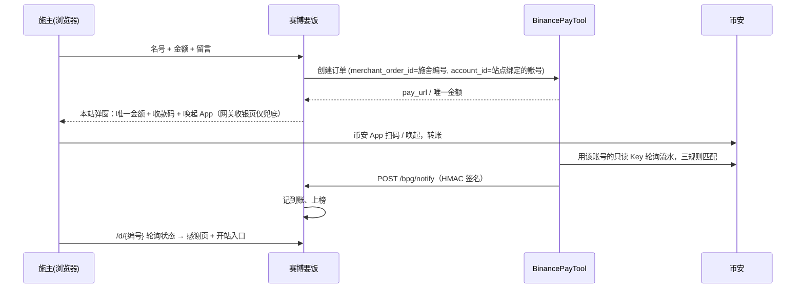

# 赛博要饭 · newbeggar

> 一个可以**要饭**的网站：你摆一只碗，别人用币安 Pay 施舍、留一句话、上施主榜；
> 任何人发一条推就能开自己的要饭站（`域名/X用户名`），钱直接进他自己的币安账户。
> 单二进制 + SQLite，收款走开源网关 [BinancePayTool](https://github.com/qianyubtc/BinancePayTool)（币安官方只读 API，秒级到账）。

**体验站：<https://newbeggar.com>** —— 作者本人的碗，欢迎来投币、丢钢镚，或者发条推开你自己的分舵。

## 玩法

- **主站**：站长的碗。展示碗里总额、施主数、今日进账；施主填名号 + 金额 + 一句话，**不离开本站**：弹窗里显示唯一金额、收款二维码 / 一键唤起币安 App、备注码，页面自动轮询，到账后弹窗直接庆祝并刻上功德簿。付了没自动确认可在弹窗里回填币安订单编号，由本站代转网关核对。
- **两个榜**：**施主榜**（给当前站长施舍最多的人）和 **乞丐榜**（所有子站按要到的金额降序）。每个站点页都有，`/rank` 是全站版。
- **开分舵（X 发推验证）**：不用先施舍。发一条带验证码的推文、贴回链接，就能开自己的要饭站 `BASE_URL/X用户名`：路径就是 X 用户名，站名锁定为 X 昵称、头像用 X 头像、一个 X 账号一个站（广告号得先养 X 号公开发推，可追溯）。开站时设口令，以后凭「X 用户名 + 口令」登录后台，忘了口令再发推找回（按 X 数字 ID 认人，改过用户名也找得回）。
- **钢镚（免费点赞币）**：不想花钱也能参与——匿名丢钢镚，每人每站每天 1 个（cookie + IP 双限制），有硬币飞进碗里的动画；**不能留言**（只有真钱能留言，堵住垃圾信息）。子站有**人气榜**按钢镚数排。
- **施主 X 身份**：投币时可填自己的 X，功德簿和施主榜显示 X 头像和 @名（头像服务端抓取缓存本地），同一 X 的施舍合并计榜。
- **反垃圾**：留言 / 名号 / 口号过滤网址和微信 / QQ / TG / 手机号等联系方式；站长可「屏蔽留言」（记录保留，显示 ***）或「屏蔽此人」（名号也隐藏，同名再投自动隐藏）；可选「新站待收录」模式（`SUBSITE_REVIEW`），未收录站不进榜、noindex。
- **丐帮体系**：EXP = 碗里的钱(U) × `MONEY_EXP`（默认 10，即 0.1 U = 1 EXP）+ 钢镚 × `COIN_EXP`（默认 1）。袋位随 EXP 升：空碗未入帮 → 一袋弟子(1) → 二袋(10) → 三袋(50) → 四袋(200) → 五袋(500) → 六袋(1000) → 七袋(3000) → 八袋(10000) → 九袋长老(50000)；职位按全站 EXP 综合名次动态授予：帮主、副帮主、传功长老、执法长老、掌棒龙头、掌钵龙头、长老、舵主、弟子，掉出名次自动易主（主站是总舵）。
- **更多玩法**：施主榜 / 乞丐榜有总榜和本周榜；施主徽章 🏁 首位施主 💎 单笔最大 🔥 常客；站长可回复留言；感谢页一键生成像素分享卡。
- **声音**：8-bit 音效全部用 Web Audio 现场合成（丢钢镚「叮」、到账小旋律、按钮 blip），不加载任何音频文件；背景音乐可选——把一段 AAC 循环片段放到 `static/bgm.m4a` 再编译就有，没有就只有音效。右上角喇叭一键静音，状态记在访客浏览器里。浏览器不允许页面一打开就出声，所以音乐在访客第一次触屏 / 点击时起播。
- **子站怎么收钱**（后台「收款方式」二选一）：
  - **绑定币安只读 API Key（推荐）**：本站把 Key 注册到 BinancePayTool 网关成为独立收款账号，网关按账号轮询他的流水，到账自动确认上榜——和主站一样全自动。Key 只要「允许读取」，网关侧 AES 加密存储。
  - **直接转账**（零门槛兜底）：子站展示站长的币安收款码 / Pay ID，施主转完点「我已施舍」，站长在后台确认后上榜。
- **后台**：改资料、设收款、确认 / 拒绝手动施舍、**屏蔽留言**（记录保留，留言显示 `***`）、回复、改口令（弹窗）；列表每页 5 条分页。
  主站站长（`ADMIN_PASSWORD`）额外能巡查全站留言、给违规子站除名、帮忘口令的站长重置。
- **像素游戏风 UI**：端着碗的像素小人吉祥物（晃碗、眨眼、掉泪），角色卡有等级 / EXP / 饱食度条，口号是 RPG 对话框打字机，投币面板闪 INSERT COIN，榜单是街机 HIGH SCORE。全站用 [缝合怪像素字体](https://github.com/TakWolf/fusion-pixel-font)（OFL，内嵌 660KB）。像素画由 `tools/sprite.py` 从字符网格生成 SVG。
- **H5 优先**：手机端单列、底部悬浮投币按钮、功德簿 / 施主榜 / 乞丐榜分段切换；桌面端双栏。

## 流程



回调丢了也不怕：状态页轮询时本站每 4 秒主动向网关查一次单。

## 快速开始

```bash
go build -o beggar .
cp config.example.env config.env
./beggar -gen-key          # 得到 ADMIN_PASSWORD 填入 config.env
# 填 BASE_URL、BPG_URL / BPG_KEY（网关地址与它的 API_AUTH_KEY）
./beggar -config config.env
```

打开 `BASE_URL/` 施舍，`BASE_URL/login`（X 用户名留空 + `ADMIN_PASSWORD`）进主站后台。之后可在后台改口令；`ADMIN_PASSWORD` 只在首次建站或 config 里的值改变时覆盖。
不想接网关也行：留空 `BPG_URL`，填 `MAIN_RECEIVE_LINK` / `MAIN_PAY_ID`，主站按直接转账模式跑（此时子站只能直接转账）。

配置项全部在 [config.example.env](config.example.env)，每项有注释。

## 页面

| 路径 | 说明 |
|---|---|
| `/` | 主站 |
| `/{x用户名}` | 子站（路径 = 站长的 X 用户名小写；撞上保留字自动加 `x_` 前缀） |
| `/d/{编号}` | 一笔施舍的状态 / 感谢页（网关 return_url 指向这里） |
| `/pay/{编号}` | 直接转账模式的付款页（二维码 / 唤起 App / Pay ID / 备注码 / 我已施舍） |
| `/new` `/reset` | 用 X 发推验证开站 / 找回口令 |
| `POST /coin` | 丢钢镚（免费，JSON） |
| `/login` `/manage` | 站长登录（X 用户名 + 口令）与后台 |
| `/rank` | 全站施主榜 + 乞丐榜 |
| `POST /bpg/notify` | 网关回调（用 `BPG_KEY` 验签，按 merchant_order_id 落状态） |

## 部署（VPS + Caddy）

```bash
GOOS=linux GOARCH=amd64 CGO_ENABLED=0 go build -trimpath -buildvcs=false -ldflags="-s -w" -o beggar-linux-amd64 .
# 服务器
sudo useradd -r -s /usr/sbin/nologin beggar && sudo mkdir -p /opt/beggar && sudo chown beggar:beggar /opt/beggar
sudo install -o beggar -g beggar -m 755 beggar-linux-amd64 /opt/beggar/beggar
sudo -u beggar cp config.example.env /opt/beggar/config.env && sudo chmod 600 /opt/beggar/config.env   # 填好
sudo cp deploy/beggar.service /etc/systemd/system/ && sudo systemctl enable --now beggar
```

Caddy 片段见 [deploy/Caddyfile](deploy/Caddyfile)。放在 Cloudflare 橙色云朵后面时，再加一个不跳转的 `http://域名` 块（兼容 Flexible 模式），并把 `TRUST_PROXY_HEADER` 设为 `CF-Connecting-IP`。与网关同机时 `BPG_URL` 可填网关内网地址（如 `http://127.0.0.1:8123`），回调地址 `BASE_URL/bpg/notify` 必须能被网关访问到。
网关需为支持多账号的版本（BinancePayTool 协议 §2.6）。上线前想清掉测试数据：`sudo bash deploy/reset-data.sh`（先备份库，只留主站资料）。

## 安全边界

- 留言、名号、口号全部经 html/template 转义；留言 80 字、名号 20 字。
- 站长口令 PBKDF2-SHA256 哈希存储；会话为 HMAC 签名 cookie（HttpOnly + SameSite=Lax），30 天。登录按 IP 与路径限流。
- 子站的币安 API Key / Secret **不落本站数据库**：直接交给网关注册，网关 AES-GCM 加密存储，任何页面都不展示。
- 子站的币安收款链接只接受 `binance.com` 域名（防止借站挂钓鱼链接）；X 只接受 `x.com` / `twitter.com` 主页。
- 开站凭证 = X 发推验证（推文正文含一次性验证码，24 小时有效、只能用一次），推文通过 X 公开的嵌入接口读取，不需要 API Key；一个 X 账号一个站。验证码绑定生成它的浏览器（cookie 里的密钥），别人看到推文里的码也用不了；找回口令时按 X 数字 ID 校验，旧用户名被别人注册也接管不了；主站口令不走 X 找回。
- 在 X / 微信等 App 内置浏览器里打开开站页会提示「用系统浏览器打开」（内置浏览器拉不起发帖深链、cookie 也不稳）；其它页面不拦，不影响传播。
- 施主头像通过公开头像服务抓取后缓存到本地 `AVATAR_DIR`，页面只引用本站文件，墙内访客也能看。
- 施舍 / 自报 / 开站 / 绑定 Key / 登录均按 IP 限流。
- 少付（网关 `underpaid`）也按实付计入——要饭嘛，给多少是多少。

## 测试

```bash
go vet ./... && go test ./... -count=1            # 单测 + mock 网关（含多账号）全流程
python3 e2e/real_gateway.py                        # 真实网关二进制 × mock 币安 × 本站（需 ../BinancePayTool 多账号版）
python3 e2e/real_gateway.py --serve --port=8124    # 同上但不退出，并造一批演示数据供浏览
```

## License

[Apache License 2.0](LICENSE)。像素字体 [缝合怪像素字体](https://github.com/TakWolf/fusion-pixel-font) 为 OFL 许可（见 `static/OFL-fusion-pixel-font.txt`）。
