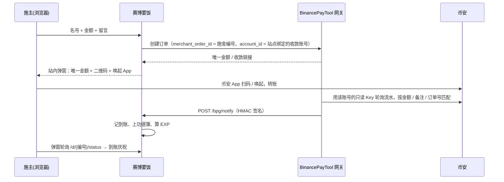

<div align="center">

# 🥣 赛博要饭 · newbeggar

**一个能「要饭」的像素风网站：摆一只碗，别人用币安 Pay 投币、留一句话、上功德簿；任何人发一条推就能开自己的分舵。**

[](go.mod)
[](LICENSE)
[](https://github.com/qianyubtc/BinancePayTool)
[](#技术栈)
[](https://newbeggar.com)
[](https://github.com/qianyubtc/newbeggar/stargazers)

**在线体验：<https://newbeggar.com>** —— 作者本人的碗。投个币、丢个钢镚，或者发条推开你自己的分舵试试。

</div>

---

## 目录

- [它是什么](#它是什么)
- [特性](#特性)
- [工作原理](#工作原理)
- [快速开始](#快速开始)
  - [1. 起一个收款网关](#1-起一个收款网关)
  - [2. 币安 API Key 怎么配](#2-币安-api-key-怎么配)
  - [3. 配置并运行本站](#3-配置并运行本站)
- [配置项参考](#配置项参考)
- [部署到服务器](#部署到服务器)
- [玩法规则](#玩法规则)
- [页面与接口](#页面与接口)
- [安全边界](#安全边界)
- [开发与测试](#开发与测试)
- [常见问题](#常见问题)
- [技术栈](#技术栈)
- [License](#license)

## 它是什么

- **主站**是站长的碗。施主填个名号、选个金额、留一句话，**不离开本站**：弹窗里出现唯一金额、收款二维码、一键唤起币安 App，页面自动轮询，到账后当场庆祝并刻上功德簿。
- **分舵**：任何人用 X 账号发一条带验证码的推文，就能开自己的要饭站 `域名/X用户名`，钱直接进他自己的币安账户。不用先施舍，不用注册，一个 X 账号一个站。
- **钢镚**：不想花钱也能玩。每人每站每天免费丢一个钢镚，有硬币飞进碗里的动画，但**不能留言**（只有真钱才能留言，堵住广告）。
- **丐帮**：钱和钢镚折成 EXP，升「一袋弟子 … 九袋长老」；全站按 EXP 排名，第一名是帮主，掉出名次自动易主。
- **像素游戏风**：端碗的像素小人吉祥物、RPG 对话框、INSERT COIN 投币面板、街机 HIGH SCORE 榜、8-bit 音效。手机优先。

**钱不经过本站。** 收款走开源网关 [BinancePayTool](https://github.com/qianyubtc/BinancePayTool)：用币安官方**只读** API 轮询你自己账户的流水做匹配，本站和网关都拿不走一分钱。

## 特性

| 模块 | 说明 |
|---|---|
| 站内付款 | 弹窗内完成：唯一金额 + 二维码 + 唤起币安 App + 自动轮询；没自动确认可回填币安订单编号，本站代转网关核对 |
| 双榜 + 周榜 | 施主榜（给当前站长投币最多的人）、乞丐榜（所有站按要到的钱排）、人气榜（按钢镚排）；总榜 / 本周切换 |
| 分舵开站 | X 发推验证：路径 = X 用户名，站名锁定 X 昵称，头像用 X 头像，验证码绑定发起的浏览器；忘口令再发推找回（按 X 数字 ID 认人，改过用户名也找得回） |
| 子站收款 | 十秒上手：填自己的币安 UID（施主在币安 App 按 UID 转账，转完自报，站长确认）；进阶：绑定币安**只读** API Key，注册到网关成独立账号，到账自动上榜 |
| 施主 X 身份 | 投币时可填自己的 X，功德簿和榜单显示 X 头像和 @名，同一 X 合并计榜 |
| 反垃圾 | 留言 / 名号 / 口号过滤网址、微信、QQ、TG、手机号；站长可屏蔽留言（显示 `***`）或屏蔽此人；可选「新站待收录」模式 |
| 徽章与回复 | 🏁 首位施主 💎 单笔最大 🔥 常客；站长可回复留言；感谢页一键生成像素分享卡 |
| 声音 | 8-bit 音效由 Web Audio 现场合成，不加载音频文件；背景音乐可选（放一个 `static/bgm.m4a` 即可）；喇叭一键静音 |
| 后台 | 改资料、设收款、确认 / 拒绝手动施舍、屏蔽、回复、改口令（弹窗）；主站站长额外可巡查全站留言、除名违规子站、帮站长重置口令 |
| 多语言 | 中文原文即 key，按语言查表：中 / 英 / 日 / 韩 / 俄 / 西 / 葡 / 法 / 德 / 越 / 印尼 / 土 12 种；按浏览器语言自动选，导航栏 🌐 可切换（记 cookie）；查不到的回落英文再回落中文 |
| 部署 | 单二进制、SQLite（无 CGO）、模板与字体全部内嵌；交叉编译扔到任何 Linux 上就能跑 |

## 工作原理



回调丢了也不怕：轮询时本站每 4 秒主动向网关查一次单。少付（网关 `underpaid`）按实付计入——要饭嘛，给多少是多少。

## 快速开始

### 1. 起一个收款网关

本站依赖 [BinancePayTool](https://github.com/qianyubtc/BinancePayTool)（需为**支持多账号**的版本，2026-09 之后的 main 都是）。按它的 README 跑起来，记下两样东西：

- 网关地址，比如 `http://127.0.0.1:8123`（与本站同机时用内网地址即可）
- 网关的 `API_AUTH_KEY`（网关 `./bpaygate -gen-key` 生成）

> 不想接网关也能跑：`BPG_URL` 留空，填 `MAIN_RECEIVE_LINK` / `MAIN_PAY_ID`，主站按「直接转账」模式工作（施主自报、站长后台确认）。此时子站也只能直接转账。

### 2. 币安 API Key 怎么配

本站**不需要**你的 API Key，Key 只给网关。两个层面：

**主站（站长自己）**：在网关的 `config.env` 里填 `BINANCE_API_KEY` / `BINANCE_API_SECRET` / `BINANCE_UID`，这是网关的默认收款账号，主站的所有订单都走它。

**子站（分舵站长）**：他们在本站后台「收款方式 → 绑定币安 API Key」里填自己的 Key、Secret、UID。本站把它注册到网关，网关加密保存并为这个账号单独轮询流水；**Key 不落本站数据库，任何页面都不展示**。

创建 Key 的步骤（币安 App）：

1. 账户 → API 管理 → 创建 API → 选「系统生成」。
2. 权限**只勾「允许读取」**（默认就是），不要开现货交易、提现、合约等任何写权限。
3. IP 白名单：主站的 Key 建议限制为网关服务器的出口 IP；分舵站长的 Key 可以不限（只读 Key 拿不走钱）。
4. 币安 UID 在 App 头像页能看到。

**最简单的收款方式不需要 Key**：分舵站长在后台填自己的**币安 UID**（App 左上角头像下面那串数字）就能收钱——施主在币安 App「支付 → 转账」里输入 UID 转账，转完自报，站长确认后上榜。绑定只读 Key 是进阶选项，好处是到账自动确认、自动上榜。

> 网关与本站都**永不发起转账**。想退款只能在币安 App 里手动转回，流水里有付款方信息。

### 3. 配置并运行本站

```bash
git clone https://github.com/qianyubtc/newbeggar.git && cd newbeggar
go build -o beggar .
cp config.example.env config.env
./beggar -gen-key                 # 生成一个随机口令，填到 config.env 的 ADMIN_PASSWORD
# 编辑 config.env：BASE_URL、BPG_URL、BPG_KEY、MAIN_NAME、MAIN_X …
./beggar -config config.env
```

打开 `BASE_URL/` 就是你的碗；`BASE_URL/login`（X 用户名留空 + `ADMIN_PASSWORD`）进主站后台。登录后可以在后台改口令，`ADMIN_PASSWORD` 只在首次建站或 config 里的值变化时才覆盖。

## 配置项参考

复制 [config.example.env](config.example.env) 为 `config.env`，同名环境变量优先于文件。

| 分组 | 键 | 默认 | 说明 |
|---|---|---|---|
| 基础 | `LISTEN` | `127.0.0.1:8124` | 监听地址 |
| | `BASE_URL` | — | 对外地址，回调、子站链接、推文里的链接都用它拼 |
| | `SITE_TITLE` | `赛博要饭` | 站名 |
| | `ADMIN_PASSWORD` | — | 主站站长口令，`./beggar -gen-key` 生成 |
| | `AUTHOR_GITHUB` / `AUTHOR_X` | 作者链接 | 页脚作者链接，留空不显示，**部署时改成你自己的** |
| 主站资料 | `MAIN_NAME` / `MAIN_SLOGAN` / `MAIN_AVATAR` | — | 首次启动写入库，之后在后台改 |
| | `MAIN_X` | — | 主站绑定的 X（`@名字` 或主页链接），头像会自动从 X 抓 |
| 收款 | `BPG_URL` / `BPG_KEY` | — | 网关地址与其 `API_AUTH_KEY`；留空则主站走直接转账 |
| | `MAIN_RECEIVE_LINK` / `MAIN_PAY_ID` | — | 直接转账模式用的收款码链接 / Pay ID |
| 施舍 | `CURRENCY` | `USDT` | 币种 |
| | `PRESET_AMOUNTS` | `0.1,1` | 金额档位，页面再加一个「自定义」 |
| | `MIN_AMOUNT` / `MAX_AMOUNT` | `0.1` / `10000` | 上下限 |
| | `ORDER_TTL` | `900` | 网关订单有效期（秒） |
| 子站 | `SUBSITES_ENABLED` | `true` | 是否开放开站 |
| | `SUBSITE_REVIEW` | `true` | 新站默认「未收录」（不进榜、noindex），主站站长后台收录。防广告站蹭曝光 |
| 钢镚 | `COINS_PER_DAY` / `COINS_IP_CAP` / `COINS_IP_TOTAL` | `1` / `3` / `30` | 每人每站每天几个；每 IP 每站每天上限；每 IP 每天全站总上限（0 不限）|
| 经验 | `MONEY_EXP` / `COIN_EXP` | `10` / `1` | EXP = 钱(U) × MONEY_EXP + 钢镚 × COIN_EXP |
| X | `X_TWEET_API` / `X_AVATAR_API` | 公开接口 | 读推文与头像的接口，一般不用改；测试时指向 mock |
| | `AVATAR_DIR` | `./avatars` | 头像缓存目录 |
| 反代 | `TRUST_PROXY` | `true` | 在反向代理后面时开启，限流按真实访客 IP |
| | `TRUST_PROXY_HEADER` | `X-Forwarded-For` | 直接反代用默认值；前面有 Cloudflare 填 `CF-Connecting-IP` |
| 存储 | `DB_PATH` | `./beggar.db` | SQLite 文件 |

## 部署到服务器

```bash
# 本机交叉编译（无 CGO，静态二进制）
GOOS=linux GOARCH=amd64 CGO_ENABLED=0 go build -trimpath -buildvcs=false -ldflags="-s -w" -o beggar-linux-amd64 .

# 服务器
sudo useradd -r -s /usr/sbin/nologin beggar && sudo mkdir -p /opt/beggar && sudo chown beggar:beggar /opt/beggar
sudo install -o beggar -g beggar -m 755 beggar-linux-amd64 /opt/beggar/beggar
sudo -u beggar cp config.example.env /opt/beggar/config.env && sudo chmod 600 /opt/beggar/config.env   # 填好
sudo cp deploy/beggar.service /etc/systemd/system/ && sudo systemctl enable --now beggar
```

- 反向代理片段见 [deploy/Caddyfile](deploy/Caddyfile)。
- 放在 **Cloudflare 橙色云朵**后面：再加一个不跳转的 `http://域名` 块（兼容 Flexible 模式），`TRUST_PROXY_HEADER=CF-Connecting-IP`，并建议防火墙只放行 Cloudflare 回源 IP。
- 与网关同机时 `BPG_URL` 填内网地址；回调地址 `BASE_URL/bpg/notify` 必须能被网关访问到。
- **更新**：编译新二进制，`sudo install` 覆盖后 `sudo systemctl restart beggar`，中断一两秒，库不动。
- **上线前清掉测试数据**：`sudo bash deploy/reset-data.sh`。先备份库，只保留主站资料、口令和会话密钥。

## 玩法规则

**EXP** = 碗里的钱(U) × 10 + 钢镚 × 1（默认，可配）。0.1 U 或 1 个钢镚都是 1 EXP。

**袋位**看自己的 EXP，不受别人影响：

| 空碗未入帮 | 一袋 | 二袋 | 三袋 | 四袋 | 五袋 | 六袋 | 七袋 | 八袋 | 九袋长老 |
|---|---|---|---|---|---|---|---|---|---|
| 0 | 1 | 10 | 50 | 200 | 500 | 1000 | 3000 | 10000 | 50000 |

**职位**按已收录子站的 EXP 名次实时授予，掉出名次自动易主；主站固定为「总舵」：

| 第 1 | 第 2 | 第 3 | 第 4 | 第 5 | 第 6 | 7–10 | 11–30 | 31+ |
|---|---|---|---|---|---|---|---|---|
| 帮主 | 副帮主 | 传功长老 | 执法长老 | 掌棒龙头 | 掌钵龙头 | 长老 | 舵主 | 弟子 |

**徽章**：🏁 首位施主 · 💎 单笔最大 · 🔥 常客（3 天以上投过）。**周榜**按周一 0 点（服务器时区）切。

## 页面与接口

| 路径 | 说明 |
|---|---|
| `/` | 主站 |
| `/{x用户名}` | 子站。路径 = 站长 X 用户名小写；撞上保留字自动加 `x_` 前缀 |
| `/rank` | 全站施主榜 / 乞丐榜 / 人气榜 |
| `/new` `/reset` | 用 X 发推验证开站 / 找回口令 |
| `/login` `/manage` | 站长登录（X 用户名 + 口令，主站留空）与后台 |
| `/d/{编号}` | 一笔施舍的状态 / 感谢页（含分享卡） |
| `/pay/{编号}` | 直接转账模式的付款页 |
| `POST /donate` | 发起施舍；带 `ajax=1` 返回弹窗用的付款面板片段 |
| `POST /coin` | 丢钢镚（JSON） |
| `POST /bpg/notify` | 网关回调，`BPG_KEY` 验签 |
| `/healthz` | 健康检查 |

## 安全边界

- 钱不经过本站：Key 只读、只给网关；子站的 Key **不落本站数据库**，由网关 AES-GCM 加密保存。
- 站长口令 PBKDF2-SHA256；会话是 HMAC 签名 cookie（HttpOnly、SameSite=Lax），改口令即作废所有会话。
- 开站验证码一次性、24 小时有效，且**绑定生成它的浏览器**，别人看到推文里的码也用不了；找回口令按 X 数字 ID 校验，旧用户名被别人注册也接管不了；主站口令不走 X 找回。
- 收款链接只接受 `binance.com`，X 只接受 `x.com` / `twitter.com`。
- 所有 POST 做同源校验，请求体 64 KB 上限，安全响应头齐全；施舍、自报、开站、绑 Key、登录、钢镚均按 IP 限流；反代后只信配置的头且取最后一跳。
- 钢镚防刷：访客标识是本站 HMAC 签名下发的 cookie（脚本自造无效，必须真开过页面），叠加「每人每站每天」「每 IP 每站每天」「每 IP 每天全站总量」三重上限。
- 施主头像抓取有域名白名单、不跟随跳转、先解码校验再落盘，页面只引用本站文件。
- 留言 / 名号 / 口号经 html/template 转义，留言 80 字、名号 20 字。

## 开发与测试

```bash
go vet ./... && go test ./... -count=1          # 单测 + mock 网关 + mock X 的全流程
python3 e2e/real_gateway.py                      # 真实网关二进制 × mock 币安 × 本站（需 ../BinancePayTool）
python3 e2e/real_gateway.py --serve --port=8124  # 同上但不退出，造一批演示数据供浏览
python3 tools/sprite.py > templates/sprite.html  # 从字符网格重新生成像素小人 / 金币 / 碗
```

多语言：模板里的中文用 `{{T "…"}}` 包起来，Go 里用 `a.T(r, "…")` / `tr(lang, "…")`，中文原文就是 key；译文在 `i18n_<lang>.go`，新增语言只需加一个文件并在 `i18n.go` 的 `langs` 里登记。`tools/i18n_wrap.py` 可把模板里裸露的中文批量包上 T 并列出 key。

背景音乐是可选的：把一段 AAC 循环片段放到 `static/bgm.m4a` 再编译即可，仓库不附带。换曲子请改文件名（静态路由是永久缓存）。

## 常见问题

**手机上背景音乐不自动播放？** 浏览器规定页面不能一打开就出声，任何网站都绕不过。本站会在访客第一次触屏 / 点击时起播，喇叭图标 🔈 表示「开着但还没放」，点一下就响。

**从 X 里点开的链接，一键发推拉不起来 / 回来验证码变了？** 那是 X 的内置浏览器，深链和 cookie 都不可靠。开站页会提示「用系统浏览器打开」并给复制链接按钮；其它页面不拦，不影响传播。同一浏览器再进开站页会复用上次的验证码，贴回推文时推文里含本浏览器生成过的任意一个有效码都认。

**广告站怎么办？** 开 `SUBSITE_REVIEW=true`，新站默认不进榜、noindex，主站站长后台收录后才进榜；已收录的站可随时除名。留言层面有联系方式过滤、屏蔽留言、屏蔽此人。

**为什么少付也算到账？** 要饭嘛，给多少是多少。网关标 `underpaid`，本站按实付计入。

**子站站长不想绑 Key？** 选「直接转账」：展示他的收款码 / Pay ID，施主转完自报，他在后台确认后上榜。

## 技术栈

Go 1.27 · 标准库 `net/http` + `html/template`（模板、字体、静态资源全部 `embed`）· SQLite（[modernc.org/sqlite](https://gitlab.com/cznic/sqlite)，无 CGO）· [BinancePayTool Go SDK](https://github.com/qianyubtc/BinancePayTool/tree/main/sdk/go) · [go-qrcode](https://github.com/skip2/go-qrcode) · 无前端框架，手写 CSS/JS · 像素字体 [缝合怪像素字体](https://github.com/TakWolf/fusion-pixel-font)（OFL）

## License

[Apache License 2.0](LICENSE)。像素字体为 [OFL 1.1](static/OFL-fusion-pixel-font.txt)。

---

<div align="center">

作者 [𝕏 @qianyuwing](https://x.com/qianyuwing) · [GitHub @qianyubtc](https://github.com/qianyubtc) · 行行好，赏个 ⭐

</div>
